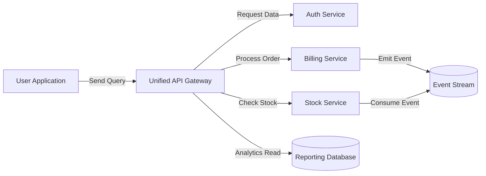

# UTS_YOGATAMA-245410074

Nama : Yogatama purwa landhika
Nim : 245410074
Prodi : informatika 
jenjang :  S1

tanggal : 17/11/2025

1. Jelaskan teorema CAP dan BASE dan keterkaitan keduanya. Jelaskan menggunakan contoh yang pernah anda gunakan.
   
teorema CAP
menyatakan bahwa dalam sistem terdistribusi, ketika terjadi network partition, sistem hanya bisa memilih antara konsistensi (C) atau ketersediaan (A). Sistem CP menjaga data tetap konsisten tetapi kadang menolak request, sedangkan AP selalu melayani request meski datanya belum konsisten.
* Consistency (C): setiap read setelah write melihat nilai terakhir (seperti DB relasional tunggal).
* Availability (A): setiap request mendapat respons (tidak boleh menolak), meskipun mungkin datanya tidak ter-update sempurna.
* Partition tolerance (P): sistem tetap bekerja meski ada pemutusan komunikasi antar-node (partition). Dalam jaringan nyata, P biasanya harus dijaga (karena partition dapat terjadi).
  
BASE
adalah pendekatan yang biasa dipakai oleh sistem AP, yaitu: Basically Available, Soft state, dan Eventual consistency.
* Basically Available: sebagian layanan tetap jawab (ketersediaan tinggi).
* Soft state: state dapat berubah seiring waktu tanpa input baru karena replikasi/timely updates.
* Eventual consistency: akhirnya semua replica akan convergent ke state yang konsisten (jika tidak ada update baru).

Keterkaitan antara CAP dan BASE (intinya)
* CAP memberi batas matematis/konseptual tentang trade-off tiga properti.
* BASE adalah pendekatan praktis/arsitektur yang mengadopsi kebanyakan pilihan AP (mengorbankan konsistensi segera) untuk mendapatkan ketersediaan tinggi dan toleransi partition.
* Pada sistem yang memilih CP, kita biasanya memakai model strong consistency (bukan BASE). Pada yang memilih AP, kita desain memakai eventual consistency => BASE.

contoh yang sering digunakan : toko online 
* Desain CP: jika dua data center kehilangan koneksi satu sama lain, sistem menolak sebagian permintaan update keranjang (mis. menolak checkout dari region terputus) agar tidak ada duplikasi/konflik (konsistensi kuat). Availability turun saat partition.
* Desain AP / BASE: masing-masing region tetap menerima update (user tetap bisa menambah barang ke cart). Sistem akan menyinkronkan perbedaan setelah koneksi pulih — ini memakai eventual consistency. Pengalaman user lebih lancar (availability tinggi) tapi ada kemungkinan konflik/cart duplicate yang kemudian harus di-resolve (merge, last-writer-wins, CRDT, dsb).

2. Jelaskan keterkaitan antara GraphQL dengan komunikasi antar proses pada sistem terdistribusi. Buat diagramnya. 

GraphQL berfungsi sebagai lapisan penghubung dalam sistem terdistribusi. Klien hanya mengirim satu query ke GraphQL, tetapi di belakang layar server GraphQL melakukan banyak komunikasi antar-proses ke berbagai microservice. Ia memanggil service berbeda menggunakan HTTP, gRPC, atau message bus, lalu menggabungkan hasilnya menjadi satu respons yang rapi. Dengan cara ini, GraphQL menyatukan data dari banyak sumber tanpa membuat klien melakukan banyak request.
Diagram :

penjelasan  :
Diagram tersebut menunjukkan alur komunikasi antara aplikasi pengguna dan layanan-layanan backend melalui Unified API Gateway. Setiap permintaan dari UserApp diarahkan ke gateway, lalu diteruskan ke layanan yang relevan seperti AuthService, BillingService, atau StockService, serta ke ReportDB untuk kebutuhan baca. Ketika BillingService menghasilkan perubahan penting, ia mengirim event ke EventStream, yang kemudian dikonsumsi oleh StockService untuk memperbarui stok tanpa komunikasi langsung antar layanan. Pola ini membuat sistem lebih terpisah, rapi, dan mudah dikembangkan karena memakai gateway terpusat dan mekanisme event-driven.

3. Dengan menggunakan Docker / Docker Compose, buatlah streaming replication di PostgreSQL yang bisa menjelaskan sinkronisasi. Tulislah langkah-langkah pengerjaannya dan buat penjelasan secukupnya.
jawaban :

ini saya mengerjakan lewat hp :

1. Siapkan struktur folder:
postgres-replication/
│
├---docker-compose.yml
└--- primary/
      |-- init.sql
2. Isi File init.sql (Primary) :
CREATE ROLE replicator WITH REPLICATION LOGIN PASSWORD 'replicatorpass';

3. Buat file docker-compose.yml
version: '3.8'

services:
  primary:
    image: postgres:15
    container_name: pg_primary
    environment:
      POSTGRES_USER: admin
      POSTGRES_PASSWORD: admin123
      POSTGRES_DB: mydb
    ports:
      - "5432:5432"
    volumes:
      - primary_data:/var/lib/postgresql/data
      - ./primary/init.sql:/docker-entrypoint-initdb.d/init.sql
    command:
      - "postgres"
      - "-c"
      - "wal_level=replica"
      - "-c"
      - "max_wal_senders=10"
      - "-c"
      - "max_replication_slots=10"

  replica:
    image: postgres:15
    container_name: pg_replica
    environment:
      POSTGRES_USER: admin
      POSTGRES_PASSWORD: admin123
    ports:
      - "5433:5432"
    depends_on:
      - primary
    volumes:
      - replica_data:/var/lib/postgresql/data
    command:
      - "bash"
      - "-c"
      - |
        rm -rf /var/lib/postgresql/data/*
        PGPASSWORD=admin123 pg_basebackup -h primary -D /var/lib/postgresql/data -U replicator -Fp -Xs -P -R
        exec postgres

volumes:
  primary_data:
  replica_data:

penjelasan :
* Primary diatur agar wal_level=replica → wajib untuk replikasi.
* pg_basebackup pada replica melakukan : Clone data dari primary, Membuat file standby.signal, Mengaktifkan mode replica otomatis.

4. jalankan
   masuk kedalam folder proyek :
   docker compose up -d

5. uji sinkkronisasi
   masuk ke primary :
   docker exec -it pg_primary psql -U admin -d mydb
   buat tabel dan insert data :
   CREATE TABLE items (id SERIAL PRIMARY KEY, name TEXT);
   INSERT INTO items(name) VALUES ('Laptop'), ('Mouse');
   masuk ke replika :
   docker exec -it pg_replica psql -U admin -d mydb
   cek data :
   SELECT * FROM items;

penjelasan :
* Primary menyimpan semua perubahan ke WAL log.
* WAL dikirimkan secara streaming ke Replica.
* Replica membaca dan menerapkan WAL log secara berurutan.
* Hasilnya: data di primary dan replica tetap sinkron otomatis.
  replikasi seperti ini digunakann :
* high availability
* backup real-time
* load balancing (read-only queries ke replica)

ringkasan :
Streaming replication dengan Docker Compose memudahkan kita membuat 2 instance PostgreSQL yang saling sinkron. Primary menghasilkan WAL log, replica menyalin dan menerapkannya secara real-time. Dengan konfigurasi sederhana di atas, proses sinkronisasi dapat diuji tanpa server fisik dan cocok untuk pembelajaran maupun testing.

